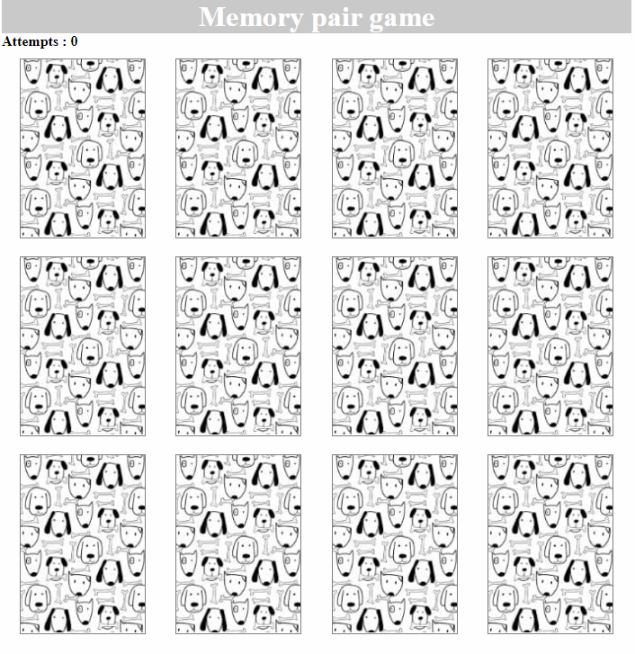

# memory-pair-game

This is an implementation of the 'memory pair game'. Done with Vanilla JS, as a part of [Kottans Frontend course](https://github.com/kottans/frontend).  

[DEMO](https://kasionio.github.io/memory-pair-game/)

### Rules 

All of the cards are laid face down and two cards are flipped face up over each turn. The object of the game is to turn over all pairs of matching cards. 
 
### Gameplay 

You can also see the number of attempts, which increases each time you flip a pair of cards.

